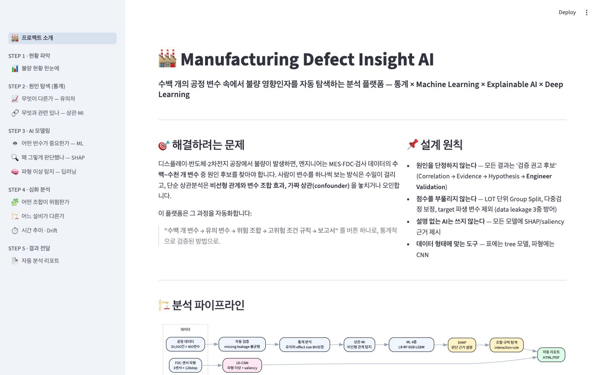
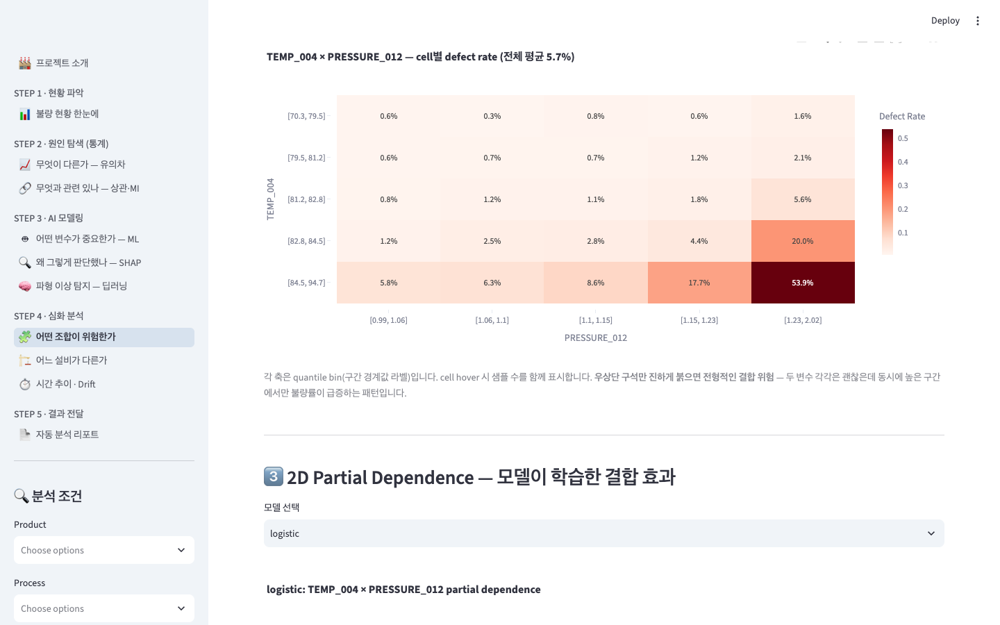
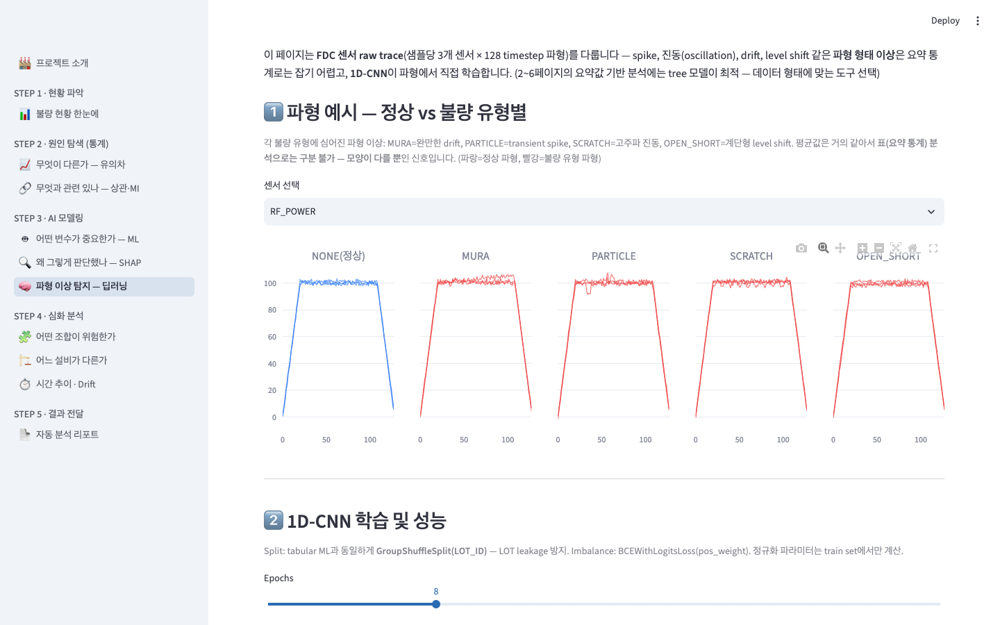
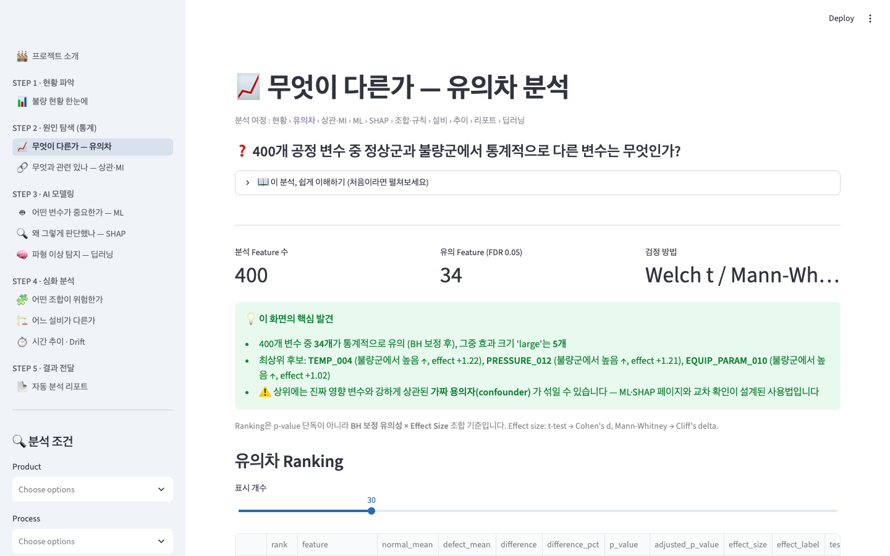
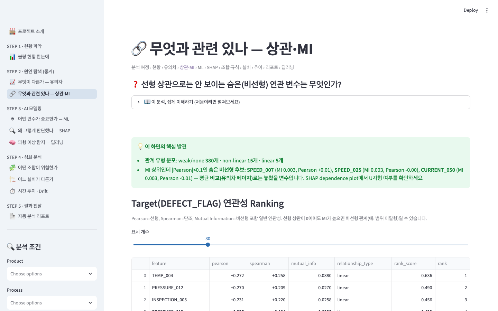

# 🏭 Manufacturing Defect Insight AI


공정 제조업 전반(디스플레이·반도체·2차전지·식품 등)에서 불량 발생 시 **수백 개의 공정 변수 중
어떤 변수가 유의한지, 어떤 변수 조합이 불량과 관련되는지, 어떤 조건에서 불량 확률이
증가하는지** 자동으로 탐색하는 분석 플랫폼입니다.

통계분석 + Machine Learning + Explainable AI(SHAP) + Rule Discovery + Deep Learning을
결합하고, 결과를 제조 엔지니어가 이해할 수 있는 대시보드와 자동 리포트로 제공합니다.

> ⚠️ 본 시스템은 "원인을 확정하는 AI"가 아닙니다. 분석 흐름은
> **Correlation → Evidence → Hypothesis → Engineer Validation** 입니다.

## 📸 화면

<p align="center">
  
</p>

| 변수 **조합** 위험 탐지 — 두 변수 동시 상승 구간에서 불량률 5.7%→**53.9%** | **파형 딥러닝** — 평균으론 같지만 모양이 다른 불량 파형 |
|---|---|
|  |  |

| 유의차 분석 — 400개 변수 자동 검정 + 핵심 발견 요약 | 상관·MI — 숨은 **비선형** 변수 탐지 |
|---|---|
|  |  |

## ☁️ Streamlit Cloud 배포

이 앱은 클라우드 배포를 지원합니다 — **데이터·모델을 git에 넣지 않고, 최초 접속 시
자동 생성**합니다 (합성 데이터는 seed 고정이라 언제 생성해도 동일함을 해시로 검증).

1. [share.streamlit.io](https://share.streamlit.io) → New app → 이 repo / `main` / `app.py`
2. 첫 접속 시 "데모 데이터셋 생성 중..." 약 1분 (컨테이너 재부팅 시에만 재생성)
3. Secrets·환경변수 불필요

## 빠른 시작

```bash
# 1. 환경 (Python 3.13+)
python3 -m venv .venv
source .venv/bin/activate
pip install -r requirements.txt

# 2. Synthetic 제조 데이터 생성 (30,000 samples × 400 features)
python -m src.data.generator

# 3. FDC trace 생성 (딥러닝 분석용 파형 데이터 — 2번 이후 실행)
python -m src.data.trace_generator

# 4. 대시보드 실행
streamlit run app.py

# 5. 테스트
pytest
```

## 대시보드 구성 (엔지니어 분석 순서)

메뉴는 분석 단계별 그룹(현황 파악 → 원인 탐색 → AI 모델링 → 심화 분석 → 결과 전달)으로
구성되며, 모든 페이지에 **"📖 이 분석, 쉽게 이해하기"** (비전문가용 설명)와
**"💡 핵심 발견"** (결과 자동 요약)이 내장되어 있습니다.

| 페이지 | 질문 | 핵심 기능 |
|---|---|---|
| 1. Overview | 불량 현황은? | KPI, 제품/공정/설비별 defect rate, 시간 trend |
| 2. Statistical Analysis | 정상과 무엇이 다른가? | Welch t / Mann-Whitney 자동 선택, Cohen's d / Cliff's delta, BH(FDR) 보정, 분포 비교 |
| 3. Correlation | 무엇과 관련이 있는가? | Pearson / Spearman / Mutual Information, 선형·단조·비선형 구분, heatmap |
| 4. ML Analysis | 어떤 변수가 중요한가? | LR / RF / XGBoost / LightGBM, PR-AUC 주지표, model consensus ranking |
| 5. SHAP | 왜 그렇게 판단했는가? | summary / bar / dependence plot, 영향 방향성 |
| 6. Multivariate | 어떤 조합이 문제인가? | interaction scan, 2D defect-rate grid, 2D partial dependence, **rule discovery** |
| 7. Equipment | 어느 설비가 다른가? | 설비별 defect rate + feature drill-down (offset 탐지) |
| 8. Time Series | 시간에 따라 변하나? | defect/feature trend, rolling mean, drift 탐지 |
| 9. AI Report | 무엇을 우선 조사하나? | 전체 파이프라인 자동 실행 → HTML 리포트 (template 기반) |
| 10. Deep Learning | 파형 이상은 없나? | FDC trace(3센서×128step) 1D-CNN, saliency 판단 근거, tabular ML 비교 |

## 아키텍처

```
Data Input → Validation → Statistical Analysis → ML → SHAP
           → Interaction / Rule Discovery → Risk 분석 → Report → Dashboard
```

```
src/
├── data/            generator(합성 데이터) · trace_generator(FDC 파형) · loader · validator
├── dl/              trace_model — 1D-CNN (PyTorch) + saliency
├── statistics/      significance(유의차+BH) · effect_size · correlation(MI 포함)
├── ml/              trainer(GroupSplit) · evaluation · feature_importance(consensus)
├── explainability/  shap_analysis
├── multivariate/    interaction · rule_discovery(Decision Tree 규칙 추출)
├── report/          report_generator(Jinja2 HTML)
└── utils/           config(전역 설정) · st_helpers(Streamlit 공통)
```

## 분석 알고리즘 요약

- **유의차**: 왜도 기반으로 Welch t-test / Mann-Whitney U 자동 선택. effect size는
  검정과 짝지어 Cohen's d / Cliff's delta. 모든 p-value에 Benjamini-Hochberg(FDR)
  보정. ranking은 p-value 단독이 아니라 유의성 × effect size 조합.
- **비선형 탐지**: Mutual Information으로 선형 상관이 0에 가까운 범위-이탈형
  변수(예: SPEED_007)도 검출.
- **ML**: `GroupShuffleSplit(groups=LOT_ID)`로 LOT 단위 leakage 차단 (time split 옵션).
  class imbalance는 class_weight / scale_pos_weight로 대응, **PR-AUC**를 주지표로 사용.
- **Consensus ranking**: 4개 모델 + SHAP rank의 trimmed mean — 단일 모델의
  구조적 한계(예: 선형 모델이 U자형 효과를 못 잡는 문제)에 의한 veto 방지.
- **Rule discovery**: class-balanced Decision Tree의 leaf 경로에서
  `TEMP_004 > 85 AND PRESSURE_012 > 1.25 → defect 14.8%` 형태의 규칙 추출.
  Support / Lift / Risk increase / Fisher exact p-value로 ranking.
- **성능 전략**: 400~1000+ features 대응 — ① variance/missing filtering →
  ② 유의성/MI 상위 선별 → ③ 상위 10~20개만 SHAP interaction/PDP.
- **딥러닝 (파형 데이터 전용)**: tabular 요약값에는 tree 모델이 최적이지만,
  FDC 센서 raw trace의 **파형 형태 이상**(spike/진동/drift/level shift)은 요약
  통계로 잡히지 않음 — 1D-CNN이 파형에서 직접 학습 (실측 PR-AUC 0.78 vs
  tabular LGBM 0.55). saliency(gradient×input)로 판단 근거 시간 구간을 표시.
  CNN도 동일하게 LOT GroupSplit + pos_weight 적용.

## Leakage 방지 규칙

ML feature에서 다음을 항상 제외합니다:
식별자(LOT_ID 등) · TIMESTAMP · DEFECT_FLAG · DEFECT_TYPE · **YIELD · QUALITY_SCORE**
(target 파생 컬럼). validator가 target 상관 0.95+ feature를 leakage 의심으로 자동 배제합니다.

## Synthetic Dataset 검증 포인트

Generator에 8가지 불량 mechanism이 심어져 있어 파이프라인의 검출력을 검증할 수 있습니다:
단일 변수(TEMP_004, PRESSURE_012), 비선형(SPEED_007 U자형), interaction(TEMP_004×PRESSURE_012),
조합(TIME_003+TEMP_004), 설비 shift(EQ_E), 시간 drift, 그리고 **confounder**
(INSPECTION_005 등 — 불량과 무관하지만 유의 변수와 강한 상관 → false positive 교육용).

## 실제 MES 데이터 연결 (향후)

1. `src/data/loader.py`의 `load_dataset()`을 DB 조회로 교체
   (`.env`의 `MES_DB_URL` 사용, parquet 캐시 유지 권장)
2. 컬럼을 config 스키마에 매핑: 식별자(LOT_ID, EQUIPMENT_ID...) + DEFECT_FLAG + 공정 변수
3. `validator`가 실데이터 품질 문제(missing/constant/leakage)를 자동 필터링
4. 이후 분석 파이프라인은 수정 없이 동작 — feature 수가 1000+ 이면
   config의 filtering 단계가 계산량을 제어

기타 확장 항목: REST API, LLM 자연어 분석/RCA, Anomaly Detection, Causal Inference 등
(`docs/PROJECT_PROMPT.md` §20).
